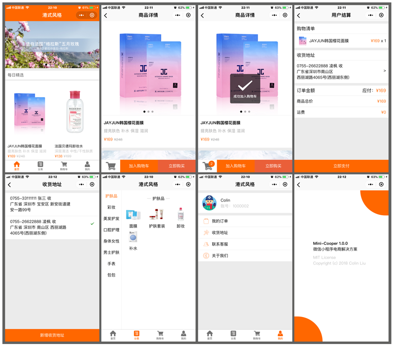

# Mini-Cooper beta

> 如果它看起来像 MINI，开起来像 MINI，那么它可能就是一台 MINI

> 微信小程序电商解决方案

## 效果预览

### 设计效果图 

[查看大图](./design)

### 扫码查看

[查看大图](./preview)

> 由于个人小程序无法上架商家自营模式（含购物车、会员中心），故无法提供预览

> 方便提供企业主体的老铁可以联系我，上架一个demo，谢谢~

## 功能介绍

### 支持功能

- 首页轮播图 √
- 首页随机商品 √
- 商品分类 √
- 购物车 √
- 收货地址 √
- 我的订单 √
- 用户中心 √
- 支付接入 (x) 个人账号无法接入

### 后台配置

- 轮播图配置 √
- 分类配置 √
- 商品配置 √
- 商品详情 √

## 使用方法

### 小程序注册

> 参考微信小程序相关文档

### 后端部署

请移步 [Mini-Cloud](https://github.com/colinlet/Mini-Cloud) - go开发

### 商品配置

> 目前只能通过通过MySQL GUI工具配置